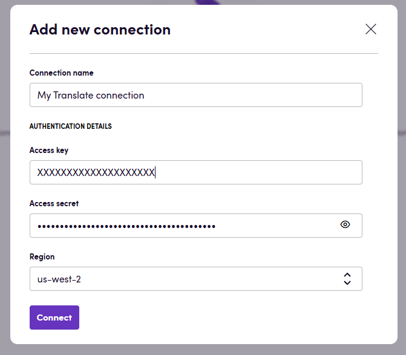
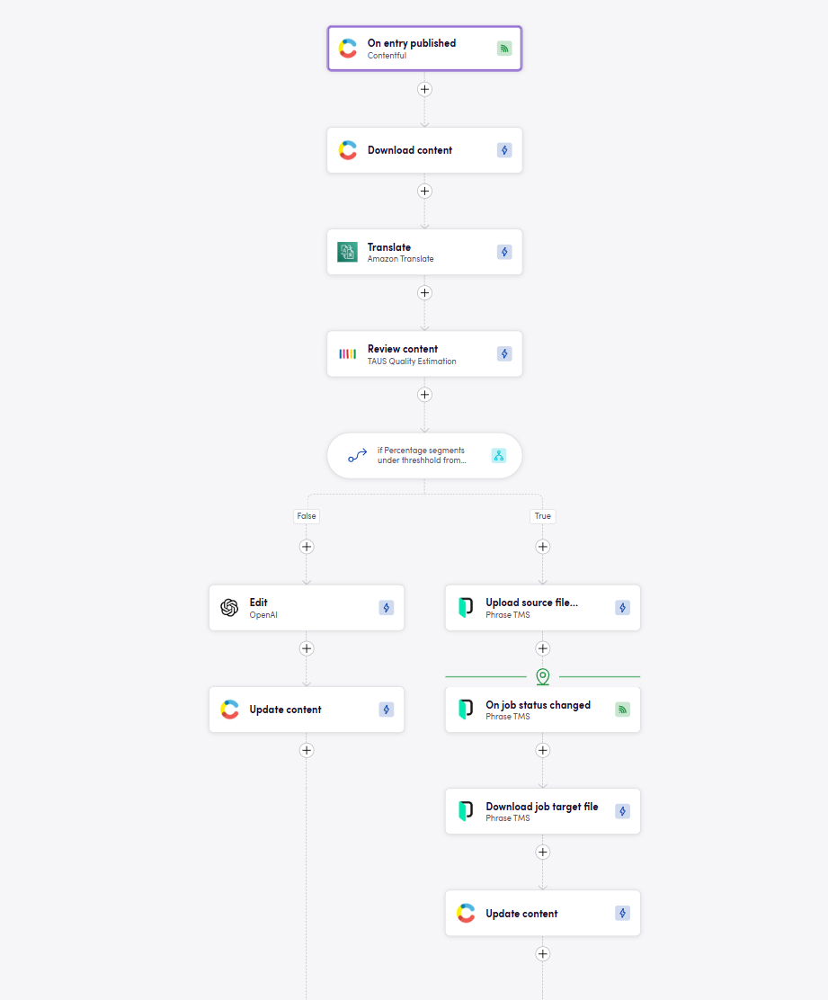

# Blackbird.io Amazon Translate

Blackbird is the new automation backbone for the language technology industry. Blackbird provides enterprise-scale automation and orchestration with a simple no-code/low-code platform. Blackbird enables ambitious organizations to identify, vet and automate as many processes as possible. Not just localization workflows, but any business and IT process. This repository represents an application that is deployable on Blackbird and usable inside the workflow editor.

## Introduction

<!-- begin docs -->

Amazon Translate is a neural machine translation service that provides fast, high-quality language translation for various applications. It supports dozens of languages, allowing businesses to easily translate large volumes of text efficiently and integrate real-time translation into their websites, applications, and content workflows. The service is commonly used for translating customer communications, website localization, and multilingual data processing.

## Before setting up

Before you can connect you need to make sure that:

- You have a **Amazon** account and you have the credentials to access it.
- You have the `Access key` and `Access secret` for your Amazon Translate account.

You can find how to get the `Access key` and `Access secret` [here](https://support.promax.com/knowledge/amazon-s3).

## Connecting

1. Navigate to Apps, and identify the **Amazon Translate** app. You can use search to find it.
2. Click _Add Connection_.
3. Name your connection for future reference e.g. 'My X connection'.
4. Enter the `Access key`, `Access secret` and select a `Region` for your Amazon Translate account.
5. Click _Connect_.
6. Verify that connection was added successfully.

## Actions

### Translate
- **Translate** Translate interopability compatible files in Blackbird interoperability mode. Can also be used to translate other file types that Amazon supports. If you're only translating text (strings) then use *Translate text* instead. Advanced settings:
  - **File translation strategy**: Select whether to use Amazon's own file processing capabilities or use Blackbird interoperability mode (the latter the the default mode).
  - **Output file handling**: If using Blackbird's interoperability mode, this determines the format of the output file. The default Blackbird behavior is to convert to XLIFF for future steps. You can change it to output the original file format (if you don't want to continue language operationts after this step).  
  - **Terminologies**: Select pre-uploaded terminology sources from Amazon.
  - **Formality**: Indicates whether the translation should be formal (depends on the language).
  - **Mask profanity**: If selected, profanity will be masked.
  - **Turn on brevity**: If selected, Amazon's brevity feature will be enabled.
- **Translate text** Translate a single text string. Useful when translating small messages. For larger content and files use *Translate* instead.

### Job
- **Start job** Start a translation job
- **Get translation job** Describe a specific translation job
- **Stop translation job** Stop a specific translation job

### Parallel Data
- **Create parallel data** Creates a parallel data resource in Amazon Translate
- **Get parallel data** Provides information about a parallel data resource
- **Update parallel data** Updates a previously created parallel data resource
- **Delete parallel data** Deletes a parallel data resource in Amazon Translate

### Terminology
- **Import terminology** Creates or updates a custom terminology
- **Import glossary** Creates or updates a custom terminology
- **Export glossary** Export a custom terminology
- **Delete terminology** Retrieves a custom terminology

## Example

In this example, a Bird is triggered when new content is published on Contentful. After translating this content with Amazon, an MTQE step is used to determine the best method for post-editing the content. After either human or machine post editing is done, the content is uploaded back to Contentful.

## Feedback

Do you want to use this app or do you have feedback on our implementation? Reach out to us using the [established channels](https://www.blackbird.io/) or create an issue.

<!-- end docs -->
